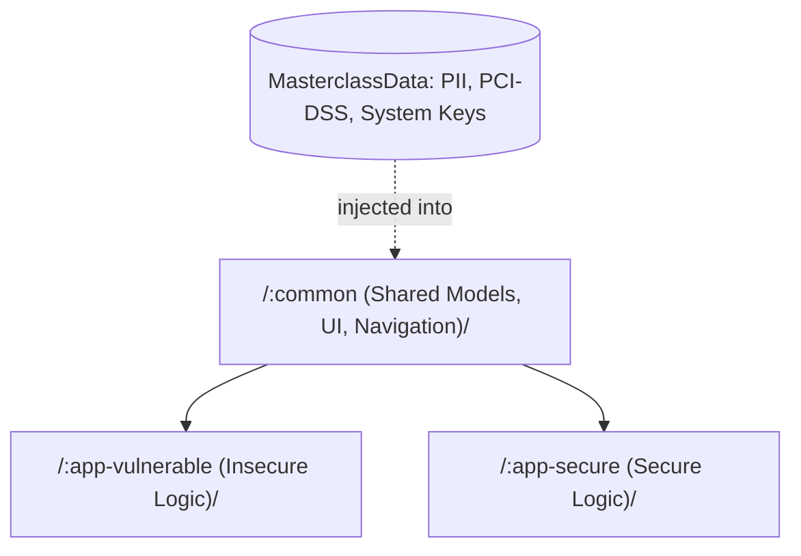

# Android Security Masterclass 🛡️📱

> **A Comprehensive Hands-on Guide to OWASP MASVS for Android Developers**

## 📖 Overview

The **Android Security Masterclass** is not just a vulnerable app; it is a **Mirror Architecture** project designed to teach Android developers and security researchers *exactly* what vulnerabilities look like and *exactly* how to fix them using modern Android development practices.

Instead of hunting for bugs in outdated Java codebases, this project uses a state-of-the-art tech stack (Kotlin, Jetpack Compose, MVVM, Material 3) and is structured around two parallel modules:

- ❌ **`:app-vulnerable`**: The "Before" state. Implements features with critical, realistic security flaws that violate OWASP MASVS standards.
- ✅ **`:app-secure`**: The "After" state. Implements the exact same UI and features, but utilizes industry best practices (e.g., Jetpack Security, Data Sanitization, R8 minification) to fully secure the data.

## 🏗️ Project Architecture

The `:common` module houses the `MasterclassData` object, which contains realistic dummy data representing highly sensitive payloads:
- **GDPR PII**: Names, emails, national identification numbers.
- **HIPAA PHI**: Health records and diagnosis codes.
- **PCI-DSS**: Credit card numbers (PAN), CVV, PINs.
- **System Crypto**: AES Master Keys, RSA Private Keys, OAuth Tokens.

## 🚀 Implemented Scenarios (Vulnerability Index)

Detailed documentation for each implemented scenario, including code samples and mitigation strategies, can be found in the `docs/` directory.

### ✅ Completed
- [**MASWE-0001**: Sensitive Data Leakage via Logging (CWE-532)](./docs/maswe/MASWE-0001-Logging-Leaks.md)
- [**MASTG-BEST-0002**: Remove Logging Code (Memory Leaks)](./docs/mastg-best/MASTG-BEST-0002-ProGuard.md)

### ⏳ Upcoming
- *MASWE-0002: Insecure Local Storage (SharedPreferences & SQLite)*

## 🛠️ How to Build and Test

1. Clone the repository and open it in **Android Studio**.
2. Select either the `app-vulnerable` or `app-secure` run configuration.
3. Build Variant Testing (Crucial for MASTG-BEST-0002):
   - **Debug**: Open the `Build Variants` tool window and select `debug`. Run the app and check **Logcat**. You will see the logs (leaks in the vulnerable app, safe/generic logs in the secure app).
   - **Release**: Switch the Build Variant to `release`. R8 (ProGuard) minification will kick in. In `app-secure`, all `SecureLog` calls will be stripped out entirely!

## ⚠️ Disclaimer

This project is created strictly for **educational purposes**. The vulnerabilities demonstrated in the `:app-vulnerable` module are real and dangerous. Do **not** use the code from the `:app-vulnerable` module in production environments. Always refer to the `:app-secure` module for best practices.
