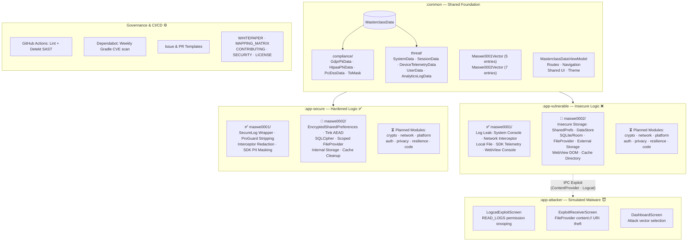

# Android Security Masterclass 🛡️📱

> **A Comprehensive Hands-on Guide to OWASP MASVS for Android Developers**


## 📖 Overview

The **Android Security Masterclass** is not just a vulnerable app; it is a **Mirror Architecture** project designed to teach Android developers and security researchers *exactly* what vulnerabilities look like and *exactly* how to fix them using modern Android development practices.

Instead of hunting for bugs in outdated Java codebases, this project uses a state-of-the-art tech stack (Kotlin, Jetpack Compose, MVVM, Material 3) and is structured around two parallel modules:

- ❌ **`:app-vulnerable`**: The "Before" state. Implements features with critical, realistic security flaws that violate OWASP MASVS standards.
- ✅ **`:app-secure`**: The "After" state. Implements the exact same UI and features, but utilizes industry best practices (e.g., Jetpack Security, Data Sanitization, R8 minification) to fully secure the data.

## 🏗️ Project Architecture


```mermaid
graph TD
    subgraph COMMON[":common — Shared Foundation"]
        direction TB
        DATA[("MasterclassData")]
        DATA --> COMP["compliance/<br/>GdprPiiData · HipaaPhiData · PciDssData · ToMask"]
        DATA --> THREAT["threat/<br/>SystemData · SessionData · DeviceTelemetryData<br/>UserData · AnalyticsLogData"]
        VECTORS["Maswe0001Vector (5 entries)<br/>Maswe0002Vector (7 entries)"]
        INFRA["MasterclassDataViewModel<br/>Routes · Navigation<br/>Shared UI · Theme"]
    end

    subgraph VULN[":app-vulnerable — Insecure Logic ❌"]
        direction TB
        V01["✅ maswe0001/<br/>Log Leak: System Console · Network Interceptor<br/>Local File · SDK Telemetry · WebView Console"]
        V02["🚧 maswe0002/<br/>Insecure Storage: SharedPrefs · DataStore<br/>SQLite/Room · FileProvider · External Storage<br/>WebView DOM · Cache Directory"]
        V_FUTURE["⏳ Planned Modules:<br/>crypto · network · platform<br/>auth · privacy · resilience · code"]
    end

    subgraph SEC[":app-secure — Hardened Logic ✅"]
        direction TB
        S01["✅ maswe0001/<br/>SecureLog Wrapper · ProGuard Stripping<br/>Interceptor Redaction · SDK PII Masking"]
        S02["🚧 maswe0002/<br/>EncryptedSharedPreferences · Tink AEAD<br/>SQLCipher · Scoped FileProvider<br/>Internal Storage · Cache Cleanup"]
        S_FUTURE["⏳ Planned Modules:<br/>crypto · network · platform<br/>auth · privacy · resilience · code"]
    end

    subgraph ATK[":app-attacker — Simulated Malware 😈"]
        direction TB
        A1["LogcatExploitScreen<br/>READ_LOGS permission snooping"]
        A2["ExploitReceiverScreen<br/>FileProvider content:// URI theft"]
        A3["DashboardScreen<br/>Attack vector selection"]
    end

    subgraph GOV["Governance & CI/CD ⚙️"]
        direction TB
        CI["GitHub Actions: Lint + Detekt SAST"]
        DEPBOT["Dependabot: Weekly Gradle CVE scan"]
        TEMPLATES["Issue & PR Templates"]
        DOCS["WHITEPAPER · MAPPING_MATRIX<br/>CONTRIBUTING · SECURITY · LICENSE"]
    end

    COMMON --> VULN
    COMMON --> SEC
    VULN -. "IPC Exploit<br/>(ContentProvider · Logcat)" .-> ATK
```

The project consists of **four modules** working in concert:

| Module | Role | Status |
| :--- | :--- | :--- |
| **`:common`** | Shared data models (`MasterclassData`), MASWE vector enums, ViewModel, UI theme, and navigation. Both apps receive the same high-fidelity data. | Foundation ✅ |
| **`:app-vulnerable`** | The "Before" state. Implements features with critical, realistic security flaws that violate OWASP MASVS standards. | MASWE-0001 ✅ · MASWE-0002 🚧 |
| **`:app-secure`** | The "After" state. The exact same UI and features, secured using Jetpack Security, Tink, SQLCipher, ProGuard, and SecureLog. | MASWE-0001 ✅ · MASWE-0002 🚧 |
| **`:app-attacker`** | A simulated malicious third-party app. Demonstrates **live** IPC exploits (FileProvider path traversal, Logcat snooping) — not theoretical ADB commands, but an actual running process on the device. | Active ✅ |

### 📦 The `MasterclassData` High-Fidelity Data Model
Unlike other educational projects that use trivial data ("admin:password"), our leak simulations use **regulation-grade** payloads:

| Data Layer | Contents | Regulatory Standard |
| :--- | :--- | :--- |
| `compliance/GdprPiiData` | National ID (TCKN), email, direct identifiers | GDPR Article 4 / Article 9 |
| `compliance/HipaaPhiData` | ICD-10 diagnosis codes, Medical Record Numbers | HIPAA §164.514 |
| `compliance/PciDssData` | PAN, CVV, PIN blocks, Track 2 data | PCI-DSS Requirement 3.2 |
| `threat/SystemData` | AES Master Keys, RSA Private Keys | MASVS-CRYPTO |
| `threat/SessionData` | OAuth tokens, CSRF tokens, session cookies | MASVS-NETWORK |
| `threat/DeviceTelemetryData` | SSAID, Advertising ID, geolocation | MASVS-PRIVACY |

> 💡 **Tip:** You can view all of this simulated data live on your device by clicking the **"Data Vault"** button on the Dashboard of either the vulnerable or secure app.

## 🚀 Implemented Scenarios (Vulnerability Index)

Detailed documentation for each implemented scenario, including code samples and mitigation strategies, can be found in the `docs/` directory.

### ✅ Completed
- [**MASWE-0001**: Sensitive Data Leakage via Logging (CWE-532)](./docs/maswe/MASWE-0001-Logging-Leaks.md)
- [**MASTG-BEST-0002**: Remove Logging Code (Memory Leaks)](./docs/mastg-best/MASTG-BEST-0002-ProGuard.md)

### 🚧 In Progress
- [**MASWE-0002**: Insecure Local Storage (SharedPreferences, DataStore, SQLite)](./docs/maswe/MASWE-0002-Insecure-Storage.md) *(Attacker App PoC Ready)*

### ⏳ Upcoming Scenarios
- **MASWE-0064**: Insecure ContentProvider (IPC Leakage)
- **MASWE-XXXX**: Deep Link & Intent Hijacking
- **MASWE-XXXX**: Insecure Network Communication (TLS/SSL Pinning)

## 🛠️ How to Build and Test

1. Clone the repository and open it in **Android Studio**.
2. Select either the `app-vulnerable` or `app-secure` run configuration.
3. Build Variant Testing (Crucial for MASTG-BEST-0002):
   - **Debug**: Open the `Build Variants` tool window and select `debug`. Run the app and check **Logcat**. You will see the logs (leaks in the vulnerable app, safe/generic logs in the secure app).
   - **Release**: Switch the Build Variant to `release`. R8 (ProGuard) minification will kick in. In `app-secure`, all `SecureLog` calls will be stripped out entirely!

### 😈 Setting up the Attacker App (`:app-attacker`)

To see the real consequences of these vulnerabilities, install the `:app-attacker` module alongside `:app-vulnerable` on the same device/emulator.

**Granting `READ_LOGS` Permission (For MASWE-0001):**
By default, Android does not allow apps to read system logs. To demonstrate how a malicious app *can* read logs if granted permission (or on rooted/older devices), you must grant this permission manually via ADB:

```bash
adb shell pm grant com.hasantuncay.mobsec.attacker android.permission.READ_LOGS
```

> **Note for Physical Devices:** If you are testing on a physical device (especially MIUI, ColorOS, etc.), running the command above might fail with a security exception. You must go to **Developer Options** and enable **"USB debugging (Security settings)"** or **"Disable permission monitoring"** to allow ADB to grant permissions.

## ⚠️ Disclaimer

This project is created strictly for **educational purposes**. The vulnerabilities demonstrated in the `:app-vulnerable` module are real and dangerous. Do **not** use the code from the `:app-vulnerable` module in production environments. Always refer to the `:app-secure` module for best practices.

## 🤝 How to Contribute

We welcome contributions from the community! Whether it's adding a new vulnerability module, improving documentation, or fixing a bug, your help is appreciated.

Please read our comprehensive [**Contributing Guide (`CONTRIBUTING.md`)**](./CONTRIBUTING.md) before opening a Pull Request. It covers our project philosophy (Mirror Architecture), coding standards, and the step-by-step process for adding new MASWE modules.

---

## 🦅 Contact & Community

**Instructor: Hasan Tunçay**
- [LinkedIn](https://www.linkedin.com/in/hasantuncay2635)
- [X (Twitter)](https://x.com/yacnutnasah)

<div align="center">
  
</div>

**Harpia Academy**
- [LinkedIn](https://www.linkedin.com/company/harpiaacademyofficial)
- [YouTube](https://www.youtube.com/@harpiaacademyofficial)
- [Instagram](https://www.instagram.com/harpiaacademyofficial)
- [X (Twitter)](https://x.com/harpiaacademy)
