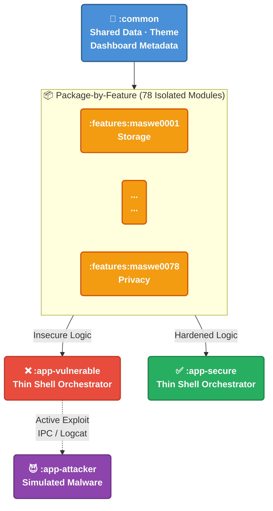
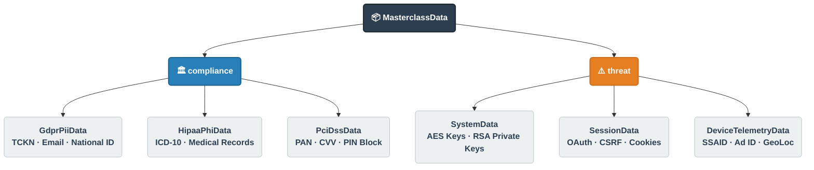
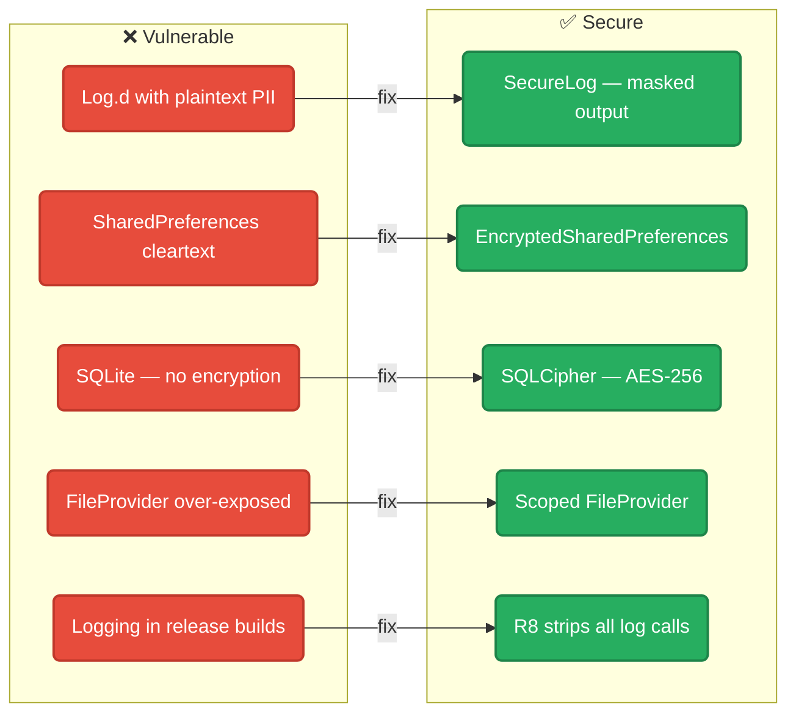
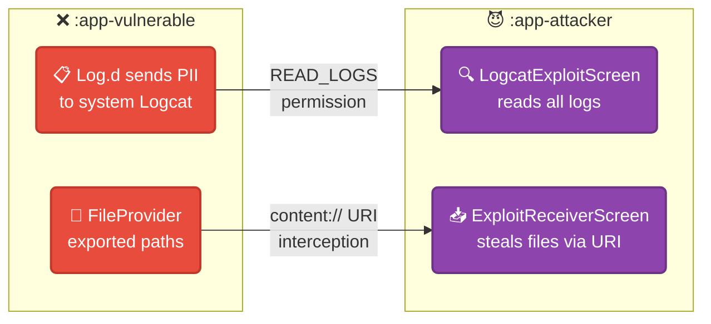
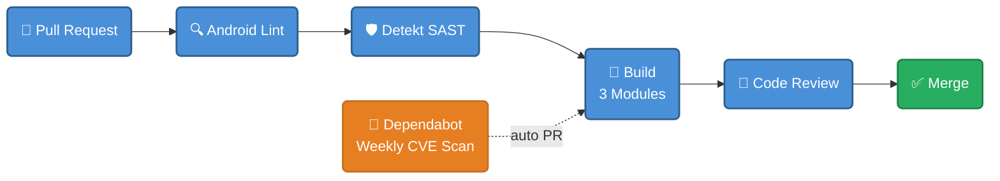

# Android Security Masterclass 🛡️📱

> **A Hands-on OWASP MASVS/MASTG Security Training Lab for Android Developers & Pentesters — Mirror Architecture: Vulnerable ↔ Secure ↔ Attacker**


## 📖 Overview

The **Android Security Masterclass** is not just a vulnerable app; it is a **Mirror Architecture** project designed to teach Android developers and security researchers *exactly* what vulnerabilities look like and *exactly* how to fix them using modern Android development practices.

Instead of hunting for bugs in outdated Java codebases, this project uses a state-of-the-art tech stack (Kotlin, Jetpack Compose, MVVM, Material 3) and is structured around three parallel modules:

- ❌ **`:app-vulnerable`**: The "Before" state. Implements features with critical, realistic security flaws that violate OWASP MASVS standards.
- ✅ **`:app-secure`**: The "After" state. Implements the exact same UI and features, but utilizes industry best practices (e.g., Jetpack Security, Data Sanitization, R8 minification) to fully secure the data.
- 😈 **`:app-attacker`**: A simulated malicious third-party app. Demonstrates **live** IPC exploits (Logcat snooping, FileProvider URI theft) — not theoretical ADB commands, but an actual running process on the device.

## 🏗️ Project Architecture


```mermaid
graph TD
    COMMON("🧱 :common<br/>Shared Data · Theme<br/>Dashboard Metadata")
    
    subgraph FEATURES ["📦 Package-by-Feature (78 Isolated Modules)"]
        direction LR
        M1(":features:maswe0001<br/>Storage")
        M2("...<br/>... ")
        M78(":features:maswe0078<br/>Privacy")
    end
    
    VULN("❌ :app-vulnerable<br/>Thin Shell Orchestrator")
    SEC("✅ :app-secure<br/>Thin Shell Orchestrator")
    ATK("😈 :app-attacker<br/>Simulated Malware")

    COMMON --> FEATURES
    FEATURES -- "Insecure Logic" --> VULN
    FEATURES -- "Hardened Logic" --> SEC
    VULN -. "Active Exploit<br/>IPC / Logcat" .-> ATK

    classDef common fill:#4A90D9,stroke:#2C5F8A,color:#fff,stroke-width:2px,font-weight:bold
    classDef feat fill:#F39C12,stroke:#D35400,color:#fff,stroke-width:2px,font-weight:bold
    classDef vuln fill:#E74C3C,stroke:#C0392B,color:#fff,stroke-width:2px,font-weight:bold
    classDef secure fill:#27AE60,stroke:#1E8449,color:#fff,stroke-width:2px,font-weight:bold
    classDef attacker fill:#8E44AD,stroke:#6C3483,color:#fff,stroke-width:2px,font-weight:bold

    class COMMON common
    class M1,M2,M78 feat
    class VULN vuln
    class SEC secure
    class ATK attacker
```

The project consists of a **Hyper-Modular "Package-by-Feature"** architecture spanning over 80 modules:

| Module Layer | Role | Status |
| :--- | :--- | :--- |
| **`:common`** | The foundation. Contains the `MasterclassData` high-fidelity payload generator, Dashboard metadata, core UI theme, and generic navigation components. | Foundation ✅ |
| **`:features:masweXXXX`** | **78 fully isolated Gradle modules** (0001 to 0078). Each module contains *both* the vulnerable and secure implementations for a single weakness, preventing cross-leakage and enabling massive team scalability. | 78 Modules Auto-Generated ✅ |
| **`:app-vulnerable`** | A "Thin Shell" orchestrator app. It wires together the insecure components from all 78 feature modules to demonstrate the exact consequence of OWASP violations. | Active ✅ |
| **`:app-secure`** | A "Thin Shell" orchestrator app. Wires together the secure implementations utilizing modern standards (Jetpack Security, Tink, SQLCipher). | Active ✅ |
| **`:app-attacker`** | A simulated malicious third-party app. Demonstrates **live** IPC exploits via a secondary process running concurrently on the device. | Active ✅ |

### 📦 The `MasterclassData` High-Fidelity Data Model
Unlike other educational projects that use trivial data ("admin:password"), our leak simulations use **regulation-grade** payloads:


```mermaid
graph TD
    ROOT("📦 MasterclassData")

    COMP("🏛️ compliance")
    THREAT("⚠️ threat")

    GDPR("GdprPiiData<br/>TCKN · Email · National ID")
    HIPAA("HipaaPhiData<br/>ICD-10 · Medical Records")
    PCI("PciDssData<br/>PAN · CVV · PIN Block")

    SYS("SystemData<br/>AES Keys · RSA Private Keys")
    SESS("SessionData<br/>OAuth · CSRF · Cookies")
    DEV("DeviceTelemetryData<br/>SSAID · Ad ID · GeoLoc")

    ROOT --> COMP
    ROOT --> THREAT
    COMP --> GDPR
    COMP --> HIPAA
    COMP --> PCI
    THREAT --> SYS
    THREAT --> SESS
    THREAT --> DEV

    classDef root fill:#2C3E50,stroke:#1A252F,color:#fff,stroke-width:2px,font-weight:bold
    classDef comp fill:#2980B9,stroke:#1F618D,color:#fff,stroke-width:2px
    classDef threat fill:#E67E22,stroke:#CA6F1E,color:#fff,stroke-width:2px
    classDef leaf fill:#ECF0F1,stroke:#BDC3C7,color:#2C3E50,stroke-width:1px

    class ROOT root
    class COMP comp
    class THREAT threat
    class GDPR,HIPAA,PCI,SYS,SESS,DEV leaf
```

| Data Layer | Contents | Regulatory Standard |
| :--- | :--- | :--- |
| `compliance/GdprPiiData` | National ID (TCKN), email, direct identifiers | GDPR Article 4 / Article 9 |
| `compliance/HipaaPhiData` | ICD-10 diagnosis codes, Medical Record Numbers | HIPAA §164.514 |
| `compliance/PciDssData` | PAN, CVV, PIN blocks, Track 2 data | PCI-DSS Requirement 3.2 |
| `threat/SystemData` | AES Master Keys, RSA Private Keys | MASVS-CRYPTO |
| `threat/SessionData` | OAuth tokens, CSRF tokens, session cookies | MASVS-NETWORK |
| `threat/DeviceTelemetryData` | SSAID, Advertising ID, geolocation | MASVS-PRIVACY |

> 💡 **Tip:** You can view all of this simulated data live on your device by clicking the **"Data Vault"** button on the Dashboard of either the vulnerable or secure app.

## 🚀 Implemented Scenarios (Vulnerability Index)

Detailed documentation for each implemented scenario, including code samples and mitigation strategies, can be found in the `docs/` directory.


```mermaid
graph LR
    subgraph BEFORE ["❌ Vulnerable"]
        direction TB
        V1("Log.d with plaintext PII")
        V2("SharedPreferences cleartext")
        V3("SQLite — no encryption")
        V4("FileProvider over-exposed")
        V5("Logging in release builds")
    end

    subgraph AFTER ["✅ Secure"]
        direction TB
        S1("SecureLog — masked output")
        S2("EncryptedSharedPreferences")
        S3("SQLCipher — AES-256")
        S4("Scoped FileProvider")
        S5("R8 strips all log calls")
    end

    V1 -- "fix" --> S1
    V2 -- "fix" --> S2
    V3 -- "fix" --> S3
    V4 -- "fix" --> S4
    V5 -- "fix" --> S5

    classDef vuln fill:#E74C3C,stroke:#C0392B,color:#fff,stroke-width:2px
    classDef secure fill:#27AE60,stroke:#1E8449,color:#fff,stroke-width:2px

    class V1,V2,V3,V4,V5 vuln
    class S1,S2,S3,S4,S5 secure
```

### 🏗️ Architecture Baseline (78 Independent Feature Modules)
The project architecture has successfully initialized and scaled out all 78 MASWE vulnerabilities into their own isolated `:features:masweXXXX` Gradle modules.

**Categories Integrated:**
- 🗄️ **Storage**: MASWE 0001 - 0006
- 🔐 **Cryptography**: MASWE 0007 - 0017
- 🔑 **Authentication**: MASWE 0018 - 0025
- 🌐 **Network**: MASWE 0026 - 0028
- 📱 **Platform**: MASWE 0029 - 0040
- 💻 **Code**: MASWE 0041 - 0050
- 🛡️ **Resilience**: MASWE 0051 - 0065
- 🕵️ **Privacy**: MASWE 0066 - 0078

### ✅ Completed Logic Implementations
- [**MASWE-0001**: Sensitive Data Leakage via Logging (CWE-532)](docs/maswe/MASVS-STORAGE/maswe_005/MASWE-0005-Logging-Leaks.md)
- [**MASTG-BEST-0002**: Remove Logging Code (Memory Leaks)](./docs/mastg-best/MASTG-BEST-0002-ProGuard.md)
- [**MASWE-0002**: Insecure Local Storage (SharedPreferences, DataStore, SQLite)](./docs/maswe/MASVS-STORAGE/maswe_002/MASWE-0002-Insecure-Storage.md) *(Attacker App PoC Ready)*

### 🚧 Active Development
Module logics (0003 through 0078) are actively being fleshed out within their isolated environments. Please refer to [docs/MAPPING_MATRIX.md](docs/MAPPING_MATRIX.md) for the complete 78-vector coverage map.

## 🛠️ How to Build and Test

1. Clone the repository and open it in **Android Studio**.
2. Select either the `app-vulnerable` or `app-secure` run configuration.
3. Build Variant Testing (Crucial for MASTG-BEST-0002):
   - **Debug**: Open the `Build Variants` tool window and select `debug`. Run the app and check **Logcat**. You will see the logs (leaks in the vulnerable app, safe/generic logs in the secure app).
   - **Release**: Switch the Build Variant to `release`. R8 (ProGuard) minification will kick in. In `app-secure`, all `SecureLog` calls will be stripped out entirely!

### 😈 Setting up the Attacker App (`:app-attacker`)

To see the real consequences of these vulnerabilities, install the `:app-attacker` module alongside `:app-vulnerable` on the same device/emulator.


```mermaid
graph LR
    subgraph VICTIM ["❌ :app-vulnerable"]
        direction TB
        LOG("📋 Log.d sends PII<br/>to system Logcat")
        FP("📂 FileProvider<br/>exported paths")
    end

    subgraph MALWARE ["😈 :app-attacker"]
        direction TB
        LE("🔍 LogcatExploitScreen<br/>reads all logs")
        ER("📥 ExploitReceiverScreen<br/>steals files via URI")
    end

    LOG -- "READ_LOGS<br/>permission" --> LE
    FP -- "content:// URI<br/>interception" --> ER

    classDef victim fill:#E74C3C,stroke:#C0392B,color:#fff,stroke-width:2px
    classDef malware fill:#8E44AD,stroke:#6C3483,color:#fff,stroke-width:2px

    class LOG,FP victim
    class LE,ER malware
```

**Granting `READ_LOGS` Permission (For MASWE-0001):**
By default, Android does not allow apps to read system logs. To demonstrate how a malicious app *can* read logs if granted permission (or on rooted/older devices), you must grant this permission manually via ADB:

```bash
adb shell pm grant com.hasantuncay.mobsec.attacker android.permission.READ_LOGS
```

> **Note for Physical Devices:** If you are testing on a physical device (especially MIUI, ColorOS, etc.), running the command above might fail with a security exception. You must go to **Developer Options** and enable **"USB debugging (Security settings)"** or **"Disable permission monitoring"** to allow ADB to grant permissions.

## 🔑 Keywords

`android security` · `owasp masvs` · `owasp mastg` · `mobile application security` · `vulnerable android app` · `security training lab` · `kotlin security` · `jetpack compose security` · `CWE-532` · `insecure data storage` · `content provider exploit` · `android penetration testing` · `GDPR` · `HIPAA` · `PCI-DSS` · `mirror architecture` · `security by design`

## ⚠️ Disclaimer

This project is created strictly for **educational purposes**. The vulnerabilities demonstrated in the `:app-vulnerable` module are real and dangerous. Do **not** use the code from the `:app-vulnerable` module in production environments. Always refer to the `:app-secure` module for best practices.

## 🤝 How to Contribute

We welcome contributions from the community! Whether it's adding a new vulnerability module, improving documentation, or fixing a bug, your help is appreciated.


```mermaid
graph LR
    PR("🔀 Pull Request")
    LINT("🔍 Android Lint")
    SAST("🛡️ Detekt SAST")
    BUILD("🔨 Build<br/>3 Modules")
    REVIEW("👀 Code Review")
    MERGE("✅ Merge")

    PR --> LINT --> SAST --> BUILD --> REVIEW --> MERGE

    DEPBOT("🤖 Dependabot<br/>Weekly CVE Scan")
    DEPBOT -. "auto PR" .-> BUILD

    classDef step fill:#4A90D9,stroke:#2C5F8A,color:#fff,stroke-width:2px
    classDef bot fill:#E67E22,stroke:#CA6F1E,color:#fff,stroke-width:2px
    classDef done fill:#27AE60,stroke:#1E8449,color:#fff,stroke-width:2px

    class PR,LINT,SAST,BUILD,REVIEW step
    class MERGE done
    class DEPBOT bot
```

Please read our comprehensive [**Contributing Guide (`CONTRIBUTING.md`)**](./CONTRIBUTING.md) before opening a Pull Request. It covers our project philosophy (Mirror Architecture), coding standards, and the step-by-step process for adding new MASWE modules.

---

## 🦅 Contact & Community

**Instructor: Hasan Tunçay**
- [LinkedIn](https://www.linkedin.com/in/hasantuncay2635)
- [X (Twitter)](https://x.com/yacnutnasah)

<div align="center">
  
</div>

**Harpia Academy**
- [LinkedIn](https://www.linkedin.com/company/harpiaacademyofficial)
- [YouTube](https://www.youtube.com/@harpiaacademyofficial)
- [Instagram](https://www.instagram.com/harpiaacademyofficial)
- [X (Twitter)](https://x.com/harpiaacademy)
