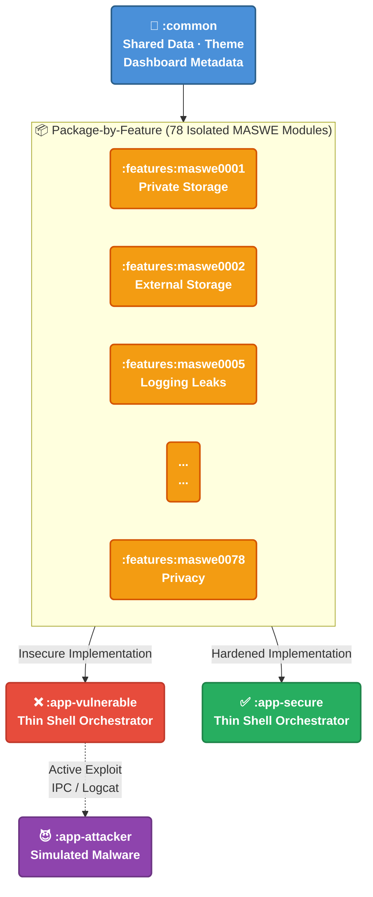
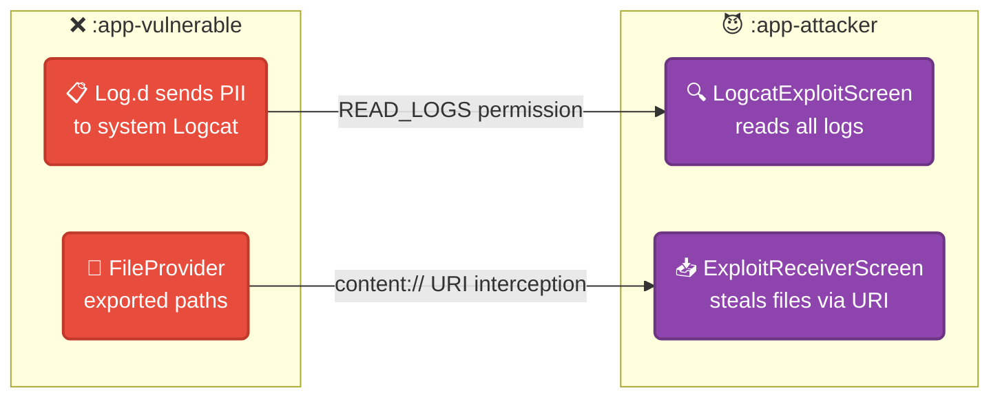

# Android Security Masterclass 🛡️📱

> **A Hands-on OWASP MASVS/MASTG Security Training Lab for Android Developers & Pentesters — Mirror Architecture: Vulnerable ↔ Secure ↔ Attacker**


## 📖 Overview

The **Android Security Masterclass** is not just a vulnerable app; it is a **Mirror Architecture** project designed to teach Android developers and security researchers *exactly* what vulnerabilities look like and *exactly* how to fix them using modern Android development practices.

Instead of hunting for bugs in outdated Java codebases, this project uses a state-of-the-art tech stack (Kotlin, Jetpack Compose, MVVM, Material 3) and is structured around a massively scalable "Package-by-Feature" system.

> 🌐 **Full Documentation:**
> The entire project, including the Whitepaper, the 78-Module Mapping Matrix, and step-by-step vulnerability guides are hosted on our dedicated MkDocs portal. 
> 
> **[👉 View the Documentation Portal Here](https://Hasan-Tuncay.github.io/Android-Security-Masterclass/)**

---

## 🏗️ The 78-Module Hyper-Modular Architecture


```mermaid
graph TD
    COMMON("🧱 :common<br/>Shared Data · Theme<br/>Dashboard Metadata")
    
    subgraph FEATURES ["📦 Package-by-Feature (78 Isolated MASWE Modules)"]
        direction LR
        M1(":features:maswe0001<br/>Private Storage")
        M2(":features:maswe0002<br/>External Storage")
        M5(":features:maswe0005<br/>Logging Leaks")
        MDOT("...<br/>... ")
        M78(":features:maswe0078<br/>Privacy")
    end
    
    VULN("❌ :app-vulnerable<br/>Thin Shell Orchestrator")
    SEC("✅ :app-secure<br/>Thin Shell Orchestrator")
    ATK("😈 :app-attacker<br/>Simulated Malware")

    COMMON --> FEATURES
    FEATURES -- "Insecure Implementation" --> VULN
    FEATURES -- "Hardened Implementation" --> SEC
    VULN -. "Active Exploit<br/>IPC / Logcat" .-> ATK

    classDef common fill:#4A90D9,stroke:#2C5F8A,color:#fff,stroke-width:2px,font-weight:bold
    classDef feat fill:#F39C12,stroke:#D35400,color:#fff,stroke-width:2px,font-weight:bold
    classDef vuln fill:#E74C3C,stroke:#C0392B,color:#fff,stroke-width:2px,font-weight:bold
    classDef secure fill:#27AE60,stroke:#1E8449,color:#fff,stroke-width:2px,font-weight:bold
    classDef attacker fill:#8E44AD,stroke:#6C3483,color:#fff,stroke-width:2px,font-weight:bold

    class COMMON common
    class M1,M2,M5,MDOT,M78 feat
    class VULN vuln
    class SEC secure
    class ATK attacker
```

The project utilizes a **Hyper-Modular** architecture spanning over 80 total modules:

| Module Layer | Role | Status |
| :--- | :--- | :--- |
| **`:common`** | The foundation. Contains the `MasterclassData` high-fidelity payload generator, Dashboard metadata, core UI theme, and generic navigation components. | Foundation ✅ |
| **`:features:masweXXXX`** | **78 fully isolated Gradle modules** (0001 to 0078). Each module contains *both* the vulnerable and secure logic for a single specific weakness, completely preventing cross-module code leakage. | 78 Modules Generated ✅ |
| **`:app-vulnerable`** | A "Thin Shell" orchestrator app. It wires together the insecure UI components from all 78 feature modules to demonstrate the exact consequence of OWASP violations. | Active ✅ |
| **`:app-secure`** | A "Thin Shell" orchestrator app. Wires together the secure implementations utilizing modern standards (Jetpack Security, Tink, SQLCipher, ProGuard). | Active ✅ |
| **`:app-attacker`** | A simulated malicious third-party app. Demonstrates **live** IPC exploits via a secondary process running concurrently on the device. | Active ✅ |

### 📦 The `MasterclassData` High-Fidelity Model
Unlike other educational projects that use trivial data ("admin:password"), our leak simulations use **regulation-grade** payloads:

*   **GDPR (Article 4 & 9)**: National Identity Numbers (TCKN), Direct Identifiers.
*   **HIPAA (§164.514)**: ICD-10 diagnosis codes, Medical Record Numbers (MRN).
*   **PCI-DSS (Req 3.2)**: Processing Track 2 data, CVV, and PIN blocks.

> 💡 **Tip:** You can view all of this simulated data live on your device by clicking the **"Data Vault"** button on the Dashboard of either the vulnerable or secure app.

---

## 🚀 Scenario Index (MASVS Integration)

We have mapped the entire OWASP MASVS standard into 78 distinct modules across 8 domains:

- 🗄️ **Storage**: MASWE 0001 - 0006
- 🔐 **Cryptography**: MASWE 0007 - 0017
- 🔑 **Authentication**: MASWE 0018 - 0025
- 🌐 **Network**: MASWE 0026 - 0028
- 📱 **Platform**: MASWE 0029 - 0040
- 💻 **Code Quality**: MASWE 0041 - 0050
- 🛡️ **Resilience**: MASWE 0051 - 0065
- 🕵️ **Privacy**: MASWE 0066 - 0078

### ✅ Initial Implemented Vectors
The following modules have their business logic and attack/defense simulations fully implemented:

1. **MASWE-0001 (Private Storage)**: Simulates plaintext leaks into SharedPreferences, DataStore, SQLite Databases, and FileProviders. Secured via Jetpack Security (EncryptedSharedPreferences), Tink, and SQLCipher.
2. **MASWE-0002 (External Storage)**: Demonstrates the risks of exporting PII to world-readable external volumes and the dangers of hardcoded/filesystem encryption keys. Secured via Keystore hardware-backed keys.
3. **MASWE-0005 (Logging Leaks)**: Demonstrates data bleeding into system logcat, network interceptors, and 3rd party SDK telemetry. Secured via ProGuard stripping (`-assumenosideeffects`) and SecureLog wrappers.

*(See the `docs/mapping_matrix.md` on the MkDocs site for the full 78-vector breakdown).*

---

## 🛠️ How to Build and Test

1. Clone the repository and open it in **Android Studio**.
2. Select either the `app-vulnerable` or `app-secure` run configuration and deploy to an emulator.
3. **Build Variant Testing (Crucial for MASWE-0005)**:
   - **Debug**: Open the `Build Variants` tool window and select `debug`. Run the app and check **Logcat**. You will see the leaks in the vulnerable app.
   - **Release**: Switch the Build Variant to `release`. R8 (ProGuard) minification will kick in. In `app-secure`, all critical logs will be stripped out entirely!

### 😈 Setting up the Attacker App (`:app-attacker`)

To see the real consequences of these vulnerabilities, install the `:app-attacker` module alongside `:app-vulnerable` on the same device.


```mermaid
graph LR
    subgraph VICTIM ["❌ :app-vulnerable"]
        direction TB
        LOG("📋 Log.d sends PII<br/>to system Logcat")
        FP("📂 FileProvider<br/>exported paths")
    end

    subgraph MALWARE ["😈 :app-attacker"]
        direction TB
        LE("🔍 LogcatExploitScreen<br/>reads all logs")
        ER("📥 ExploitReceiverScreen<br/>steals files via URI")
    end

    LOG -- "READ_LOGS permission" --> LE
    FP -- "content:// URI interception" --> ER

    classDef victim fill:#E74C3C,stroke:#C0392B,color:#fff,stroke-width:2px
    classDef malware fill:#8E44AD,stroke:#6C3483,color:#fff,stroke-width:2px

    class LOG,FP victim
    class LE,ER malware
```

**Granting `READ_LOGS` Permission (For MASWE-0005):**
By default, Android does not allow apps to read system logs. To demonstrate how a malicious app *can* read logs if granted permission (or on rooted/older devices), you must grant this permission manually via ADB:

```bash
adb shell pm grant com.hasantuncay.mobsec.attacker android.permission.READ_LOGS
```

> **Note for Physical Devices:** If testing on MIUI, ColorOS, etc., you must go to **Developer Options** and enable **"USB debugging (Security settings)"** to allow ADB to grant permissions.

---

## ⚠️ Disclaimer

This project is created strictly for **educational purposes**. The vulnerabilities demonstrated in the `:app-vulnerable` module are real and dangerous. Do **not** use the code from the `:app-vulnerable` module in production environments. Always refer to the `:app-secure` module for best practices.

## 🤝 How to Contribute

We welcome contributions from the community! Please read our comprehensive **[Contributing Guide](CONTRIBUTING.md)** before opening a Pull Request. It covers our project philosophy (Package-by-Feature Mirror Architecture), coding standards, and the step-by-step process for generating and implementing logic inside the `:features:masweXXXX` modules.

---

## 🦅 Contact & Community

**Instructor: Hasan Tunçay**
- [LinkedIn](https://www.linkedin.com/in/hasantuncay2635)
- [X (Twitter)](https://x.com/yacnutnasah)

<div align="center">
  
</div>

**Harpia Academy**
- [LinkedIn](https://www.linkedin.com/company/harpiaacademyofficial)
- [YouTube](https://www.youtube.com/@harpiaacademyofficial)
- [Instagram](https://www.instagram.com/harpiaacademyofficial)
- [X (Twitter)](https://x.com/harpiaacademy)
