# Static Application Security Testing (SAST) Pipeline Architecture

> **Scope Isolation Principle:** All automated security checks in this project are scoped **exclusively** to the `:app-secure` module. The `:app-vulnerable` and `:app-attacker` modules contain intentionally insecure code by design and are therefore exempt from all static analysis enforcement.

---

## Pipeline Philosophy

Traditional CI/CD pipelines enforce code quality uniformly across an entire codebase. This project's **Mirror Architecture** demands a fundamentally different approach: we must enforce security standards on the defensive codebase (`:app-secure`) while deliberately preserving the offensive codebase (`:app-vulnerable`, `:app-attacker`) in its insecure state.

Running SAST tools against intentionally vulnerable code would produce hundreds of **true-but-irrelevant** findings, creating noise that obscures real defects in the secure implementation.

```
┌─────────────────────────────────────────────────────┐
│                 SAST Scope Boundary                  │
│                                                      │
│   ✅ ENFORCED            ❌ EXEMPT                   │
│   :app-secure            :app-vulnerable             │
│   :common                :app-attacker               │
│                                                      │
│   "Does our defense      "Intentionally broken       │
│    actually work?"        by design."                 │
└─────────────────────────────────────────────────────┘
```

---

## Architecture Overview

```mermaid
graph TD
    subgraph TRIGGER["Trigger Events"]
        PR["Pull Request → main"]
        PUSH["Push → main"]
        CRON["Weekly Cron Schedule"]
        TAG["Release Tag (vX.Y.Z)"]
    end

    subgraph L1["Layer 1 — Developer Workstation"]
        direction TB
        KTLINT["Ktlint<br/>Code Formatting<br/>⚡ ~2s"]
        ERRPRONE["ErrorProne<br/>Compile-Time Analysis<br/>⚡ 0s overhead"]
        L1_NOTE["Runs on: every local build<br/>Target: :app-secure only"]
    end

    subgraph L2["Layer 2 — PR Gate (GitHub Actions)"]
        direction TB
        LINT["Android Lint<br/>Security + Compose Rules<br/>⏱ ~2min"]
        DETEKT["Detekt<br/>Kotlin Quality + Security<br/>⏱ ~30s"]
        BUILD["assembleDebug<br/>Compilation Verification<br/>⏱ ~3min"]
        L2_NOTE["Runs on: every PR & push to main<br/>Target: :app-secure & :common only<br/>Failure → merge blocked"]
    end

    subgraph L3["Layer 3 — Scheduled Scan"]
        direction TB
        DEPCHECK["OWASP Dependency-Check<br/>CVE Database Scan<br/>⏱ ~5-10min"]
        L3_NOTE["Runs on: weekly cron (Monday 09:00 UTC)<br/>Target: all Gradle dependencies"]
    end

    subgraph L4["Layer 4 — Release Gate"]
        direction TB
        MOBSF["MobSF<br/>APK Reverse Engineering<br/>⏱ ~15min"]
        PROGUARD["R8/ProGuard Verification<br/>Log stripping validation<br/>⏱ ~5min"]
        L4_NOTE["Runs on: release tag only<br/>Target: :app-secure release APK"]
    end

    PR --> L2
    PUSH --> L2
    CRON --> L3
    TAG --> L4
    TAG --> L2

    style L1 fill:#1a1a2e,stroke:#00d2ff,color:#ffffff
    style L2 fill:#16213e,stroke:#0f3460,color:#ffffff
    style L3 fill:#1a1a2e,stroke:#e94560,color:#ffffff
    style L4 fill:#0f3460,stroke:#e94560,color:#ffffff
```



---

## Layer Definitions

### Layer 1 — Developer Workstation (Every Build)

The fastest feedback loop. These tools are embedded into the Gradle build process itself and run automatically during compilation. Zero additional developer effort required.

| Tool | What It Does | Why It Matters | Overhead |
| :--- | :--- | :--- | :--- |
| **Ktlint** | Enforces Kotlin coding conventions (import ordering, spacing, line length) | Eliminates style-related PR review noise. Developers focus on logic, not formatting | < 2 seconds |
| **ErrorProne** | Google's compile-time static analysis. Detects null-safety violations, incorrect threading annotations, and common Java/Kotlin API misuse | Catches bugs **before** the code even runs. Zero runtime cost — analysis happens during `javac`/`kotlinc` compilation | 0 seconds (piggybacks on compilation) |

**Scope:** `:app-secure` module only.
**When:** Automatically, on every `./gradlew assembleDebug`.

---

### Layer 2 — PR Gate / GitHub Actions (Every PR & Push)

The primary quality gate. If any check in this layer fails, the Pull Request **cannot be merged** into `main`. This is the enforcement layer that ensures no regression enters the secure codebase.

| Tool | What It Does | Why It Matters | Duration |
| :--- | :--- | :--- | :--- |
| **Android Lint** | Scans for Android-specific security issues: `LocalContextGetResourceValueCall`, exported components, cleartext traffic, missing permissions, Compose best practices | The Android platform's own security ruleset. Catches vulnerabilities that generic Kotlin linters miss (e.g., insecure `WebView` settings, `FileProvider` misconfigurations) | ~2 min |
| **Detekt** | Kotlin static analysis: cyclomatic complexity, code smells, long methods, hardcoded credentials, insecure random number generation | Enforces code quality thresholds. Prevents technical debt from accumulating in the secure reference implementation | ~30 sec |
| **assembleDebug** | Full Gradle compilation of `:app-secure` and `:common` | Ensures the codebase compiles without errors after every change | ~3 min |

**Scope:** `:app-secure` and `:common` modules only.
**When:** Triggered automatically by GitHub Actions on every `pull_request` and `push` to `main`.
**Enforcement:** Build failure → PR merge is blocked via Branch Protection Rules.

#### Why `:common` Is Also Scoped In
The `:common` module contains `MasterclassData`, `ToMask<T>`, and shared ViewModels. A defect in `:common` propagates to both apps. Since `:app-secure` depends on `:common`, the shared foundation must also meet quality standards.

---

### Layer 3 — Scheduled Scan (Weekly Cron)

Heavy, time-consuming scans that would slow down the PR feedback loop if run on every commit. These run in the background on a fixed schedule.

| Tool | What It Does | Why It Matters | Duration |
| :--- | :--- | :--- | :--- |
| **OWASP Dependency-Check** | Downloads the National Vulnerability Database (NVD) and cross-references every Gradle dependency against known CVEs | A dependency you added 6 months ago might have a critical CVE disclosed today. Dependabot covers this partially, but OWASP Dep-Check performs deeper transitive dependency analysis | ~5-10 min |

**Scope:** All Gradle dependencies (project-wide).
**When:** Weekly cron job (Monday 09:00 UTC).
**Notification:** Opens a GitHub Issue if a CVE is found with severity ≥ HIGH.

---

### Layer 4 — Release Gate (Tag-Triggered)

The most comprehensive and expensive checks. Run only when a release candidate is tagged (e.g., `v1.0.0`). These validate the **final production artifact** (the signed APK), not just the source code.

| Tool | What It Does | Why It Matters | Duration |
| :--- | :--- | :--- | :--- |
| **MobSF (Mobile Security Framework)** | Automated APK reverse engineering: decompiles the APK, scans for hardcoded secrets, insecure configurations, exported components, and generates a security scorecard | Source-level SAST can miss issues introduced by the build process (e.g., R8 not stripping a class, a manifest merger conflict exposing a component). MobSF analyzes the **actual artifact** that users install | ~15 min |
| **R8/ProGuard Verification** | Validates that `SecureLog` calls are completely stripped from the release APK by decompiling and grepping for log signatures | MASWE-0001 mitigation relies on ProGuard stripping log calls. If R8 rules are misconfigured, sensitive logs could ship to production. This check is the final safety net | ~5 min |

**Scope:** `:app-secure` release APK only.
**When:** Triggered by a Git tag matching `v*.*.*`.

---

## Scope Isolation: Why Not Lint Everything?

| Module | Lint Enforced? | Rationale |
| :--- | :---: | :--- |
| `:app-secure` | ✅ Yes | This is the **reference implementation**. Every line must meet OWASP MASVS standards. Lint failures here indicate a real regression in our security posture |
| `:common` | ✅ Yes | Shared foundation. Defects here propagate to both apps |
| `:app-vulnerable` | ❌ No | Contains **intentionally insecure** code (CWE-312, CWE-532, etc.). Lint would flag hundreds of "violations" that are functioning as designed. This noise would mask real issues |
| `:app-attacker` | ❌ No | Simulated malware. Deliberately uses dangerous APIs (`READ_LOGS`, broad `FileProvider` access). Enforcing security lint on a malware simulator is contradictory |

---

## Implementation Status

| Layer | Tool | Status | Configuration |
| :--- | :--- | :---: | :--- |
| Layer 2 | Android Lint | ✅ Active | `.github/workflows/android_ci.yml` |
| Layer 2 | Detekt | ⏳ Planned | Requires `detekt` Gradle plugin + `detekt.yml` config |
| Layer 1 | Ktlint | ⏳ Planned | Requires `ktlint` Gradle plugin |
| Layer 1 | ErrorProne | ⏳ Planned | Requires `errorprone` Gradle plugin + `NullAway` |
| Layer 3 | OWASP Dep-Check | ⏳ Planned | Requires `dependency-check` Gradle plugin + cron workflow |
| Layer 3 | Dependabot | ✅ Active | `.github/dependabot.yml` (weekly Gradle scan) |
| Layer 4 | MobSF | ⏳ Planned | Requires Docker-based CI job + release workflow |
| Layer 4 | R8 Verification | ⏳ Planned | Requires `apkanalyzer` + custom shell script |
