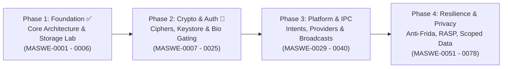

# About OWASP Android Security Masterclass 🛡️📱

The **OWASP Android Security Masterclass** is an official Open Source OWASP project designed to deliver a modern, hands-on, and regulation-grade security engineering lab for Android developers, penetration testers, and application security architects.

---

## 🎯 Project Mission

Modern mobile application security cannot rely on outdated patterns or isolated vulnerability snippets. Our mission is to bridge the gap between **software architecture** and **offensive/defensive security engineering**:

1. **Mirror Architecture**: For every vulnerability scenario, we provide both the insecure anti-pattern (`:app-vulnerable`) and the production-grade secure reference implementation (`:app-secure`).
2. **Interactive Exploit Verification**: With `:app-attacker`, practitioners can witness live Inter-Process Communication (IPC), permission abuse, and system leaks from a secondary rogue process on the device.
3. **Full MASVS / MASWE Taxonomy**: Mapped across all 78 distinct Mobile Application Security Weakness Enumeration (MASWE) categories spanning Storage, Crypto, Auth, Network, Platform, Code Quality, Resilience, and Privacy.

---

## 🗺️ Project Roadmap & Maturity

As an **OWASP Incubator Project**, the roadmap follows a phased implementation plan:

### Milestone Milestones
- [x] Hyper-Modular Package-by-Feature Gradle build logic
- [x] Regulation-grade synthetic payload generator (`MasterclassData`)
- [x] Storage Domain (`MASWE-0001` through `MASWE-0006`)
- [x] Modern Cryptography Baseline (`MASWE-0007`)
- [ ] Platform & IPC Security Lab (`MASWE-0029` - `MASWE-0040`)
- [ ] MASTG Automated Verification & CI/CD pipeline
- [ ] Companion CTF / Workshop Challenges

---

## 👥 Leadership & Governance

This project is governed by the principles of the **OWASP Foundation**:

* **Project Leader:** Hasan Tunçay ([hasan.tuncay@owasp.org](mailto:hasan.tuncay@owasp.org))
* **License:** Apache License 2.0 (Code) / Creative Commons Attribution-ShareAlike 4.0 (Documentation)
* **Code of Conduct:** We adhere to the [OWASP Code of Conduct](https://owasp.org/www-policy/operational/code-of-conduct).
* **Community:** Join discussions on [OWASP Slack](https://owasp.slack.com/) in `#project-android-security-masterclass`.
