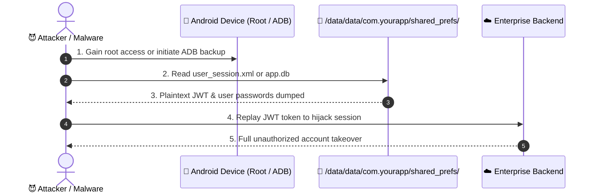
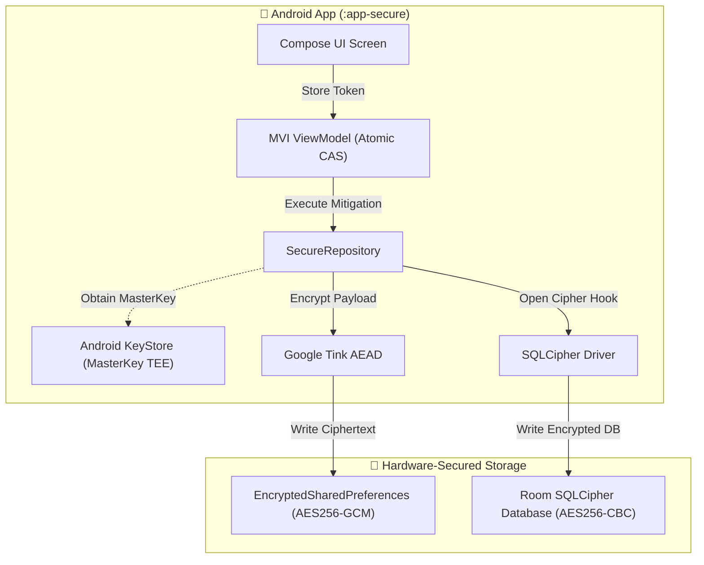

# MASWE-0001: Sensitive Data Stored Unencrypted in Private Storage

## Overview
**Category:** MASVS-STORAGE  
**Vulnerability:** Sensitive Data Stored Unencrypted in Private Storage Locations  
**CWEs:** CWE-312 (Cleartext Storage of Sensitive Information), CWE-922, CWE-200, CWE-732  
**MASTG Test:** MASTG-TEST-0001  
**MITRE ATT&CK Mobile:** T1409 (Access Stored Data), T1533 (Data from Local System)  
**CVSS v4.0 Score:** **7.5 HIGH** (`CVSS:4.0/AV:L/AC:L/AT:N/PR:N/UI:N/VC:H/VI:N/VA:N/SC:N/SI:N/SA:N`)  
**NIST Standards:** NIST SP 800-163 Rev. 1 (§4.1), NIST SP 800-53 (SC-28)  
**Industry Compliance:** PCI-DSS v4.0 (Req 3.4), Google Play MASA (§1.1)  

MASWE-0001 covers vulnerabilities where sensitive information (passwords, auth tokens, session IDs, PII, financial data) is stored in the application's internal private storage directory (`/data/data/<package_name>/`) in unencrypted plaintext. While Android uses Linux user sandboxing to isolate applications, plaintext data is completely exposed to attackers with root privileges, physical access, ADB backup extraction, or local path traversal exploits.

---

## 🛑 Vulnerability Vectors (The "Attacker" Perspective)

Our `:app-vulnerable` module demonstrates 6 distinct private storage anti-patterns:

1. **SharedPreferences Plaintext XML:** Writing credentials into `shared_prefs/user_session.xml`. The data is stored in cleartext XML and easily extracted.
2. **Unencrypted DataStore (Protobuf):** Serializing auth tokens into Jetpack DataStore without encryption. **Binary Protobuf is NOT encryption.**
3. **Room/SQLite Cleartext Database:** Storing credit card PAN and CVV in a standard SQLite database (`.db`) and unencrypted Write-Ahead Log (WAL) journals.
4. **Exported FileProvider Root Path:** Misconfiguring `<root-path path="/" />` in `file_paths.xml`, allowing malicious external apps to request internal XML files via Content URI.
5. **WebView DOM Storage (localStorage):** Enabling `domStorageEnabled` allows web scripts to write tokens to unencrypted LevelDB files on disk.
6. **Persistent Cache Files:** Creating temporary sensitive PDFs in `getCacheDir()` without calling `deleteOnExit()`.

### 📊 Attack Flow Sequence

---

## 🛡️ Mitigations & Secure Implementation (The "Secure" Perspective)

Our `:app-secure` module applies defense-in-depth to remediate these vulnerabilities:

1. **Jetpack Security (EncryptedSharedPreferences):** Encrypting keys using **AES-256-SIV** and values using **AES-256-GCM** authenticated cipher backed by Android Keystore.
2. **Tink AEAD over DataStore:** Wrapping Jetpack DataStore serialization in an authenticated encryption stream (Aead).
3. **SQLCipher for Room:** 256-bit AES database encryption for all tables, indexes, WAL journals, and temporary files.
4. **Strict FileProvider Rules:** Restricting scopes strictly to `<files-path>` or `<cache-path>` subdirectories with non-guessable filenames.
5. **In-Memory Streaming:** Keeping sensitive tokens exclusively in volatile RAM (`StateFlow`), wiping on process termination.

### 📊 Secure Architecture Diagram

---

## 🧰 Verification & Automation Suite (`poc/`)

The `:features:maswe0001` module includes complete automation scripts:
- **`poc/frida_hook.js`**: Runtime interceptor capturing `SharedPreferencesImpl.getString` and `EditorImpl.putString` calls.
- **`poc/semgrep_rule.yml`**: Static analysis rule for CI/CD gates detecting plaintext SharedPreferences and unencrypted DataStore.
- **`poc/adb_verify.sh`**: One-line terminal verification inspecting `/data/data/.../shared_prefs/` for cleartext credentials.
