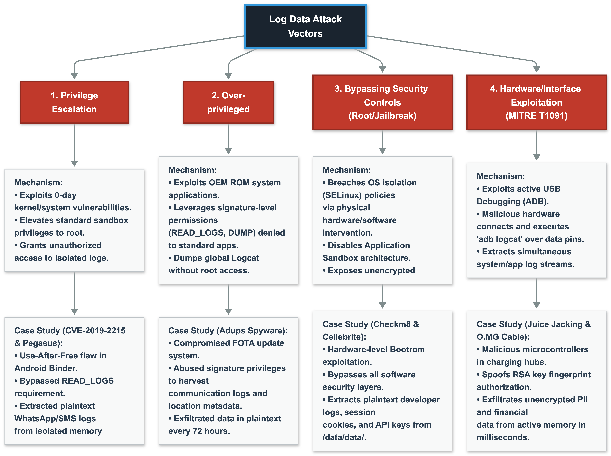

**Attack Vectors Targeting Log Data and Case Studies**

* **Privilege Escalation (MITRE T1068)**
* **Mechanism:** The process where malware installed on a device with standard (in-sandbox)
  privileges exploits zero-day vulnerabilities in the operating system kernel or system services to
  achieve root privileges. This action grants unauthorized access to the application's isolated log
  directories.
* **Real-World Example (CVE-2019-2215):** A Use-After-Free vulnerability located in the Binder
  component of the Android operating system. The Pegasus (Android variant Chrysaor) spyware,
  developed by NSO Group, utilized this vulnerability to execute Local Privilege Escalation. This
  malware, despite lacking the `READ_LOGS` permission, seized kernel privileges to gain direct
  access to plaintext logs within the isolated memory spaces of WhatsApp and SMS services.

* **Over-privileged OEM Applications**
* **Mechanism:** The exploitation of system applications embedded into the ROM (Read-Only Memory) by
  device manufacturers (OEMs) that possess signature-level permissions, such as `READ_LOGS` or
  `DUMP`, which are strictly restricted from standard applications. An attacker can exploit these
  services to dump the global log buffer (Logcat) without requiring device root access.
* **Real-World Example (Adups Spyware Scandal):** Discovered in 2016 within the Shanghai Adups
  Technology software, which provided the pre-installed Firmware Over-The-Air (FOTA) update system
  for various Android device manufacturers. By leveraging the signature-level privileges of the
  system application, communication logs, call histories, and location metadata on users' devices
  were collected in the background and exfiltrated to external servers in plaintext every 72 hours.

* **Bypassing Security Controls (Root/Jailbreak)**
* **Mechanism:** The breaching of operating system isolation (SELinux - Security-Enhanced Linux)
  policies via hardware or software-based interventions by gaining physical control of the device.
  This process completely disables the Application Sandbox architecture that protects unencrypted
  local log files (SharedPreferences, SQLite).
* **Real-World Example (Checkm8 and Digital Forensics Extractions):** The Checkm8 Read-Only Memory (
  Bootrom) vulnerability in Apple devices or professional data extraction hardware (e.g., Cellebrite
  UFED) bypasses the software security layers of the operating system at the hardware level. When a
  physical dump of the device is acquired, plaintext developer logs left in the production
  environment, session cookies written to SQLite databases, and API keys located in the
  `/data/data/com.app.name/` directory are obtained in a fully compromised state.

* **Hardware/Interface Exploitation (MITRE T1091)**
* **Mechanism:** The scenario where Developer Options and USB Debugging modes are left active on the
  device. Connecting the device to malicious hardware (a charging station or Host PC) results in the
  simultaneous extraction of the entire system and application log stream via the `adb logcat`
  command over the ADB (Android Debug Bridge) protocol.
* **Real-World Example (Juice Jacking and O.MG Cable Exploits):** Malicious microcontrollers
  integrated into public USB charging stations or physically manipulated hardware cables (O.MG
  Cable) request automatic ADB authorization via the device's data pins. If the user approves the
  RSA key fingerprint, unencrypted PII (Personally Identifiable Information) and financial data
  running in the background or held in memory are exfiltrated within milliseconds through active
  `adb logcat` monitoring.