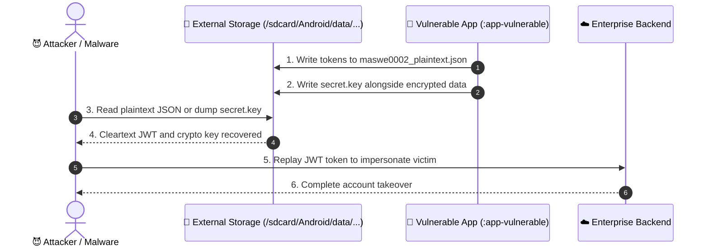

# MASWE-0002: Sensitive Data Stored Unencrypted Outside of Private Storage

## Overview
**Category:** MASVS-STORAGE  
**Vulnerability:** Sensitive Data Stored Unencrypted in Shared / External Storage Locations  
**CWEs:** CWE-732 (Incorrect Permission Assignment), CWE-312, CWE-922, CWE-321, CWE-326, CWE-320  
**MASTG Tests:** MASTG-TEST-0002, MASTG-TEST-0006  
**MITRE ATT&CK Mobile:** T1409 (Access Stored Data), T1533 (Data from External Storage)  
**CVSS v4.0 Score:** **7.5 HIGH** (`CVSS:4.0/AV:L/AC:L/AT:N/PR:N/UI:N/VC:H/VI:N/VA:N/SC:N/SI:N/SA:N`)  
**NIST Standards:** NIST SP 800-163 Rev. 1 (§4.1), NIST SP 800-53 (AC-3, SC-28)  
**Industry Compliance:** PCI-DSS v4.0 (Req 3.4), Google Play MASA (§1.2)  

MASWE-0002 covers vulnerabilities where sensitive information (bearer tokens, session cookies, passwords, credit card PANs) is written to external or shared storage (`getExternalFilesDir()`, SD cards, Downloads). Because external storage is accessible via ADB, removed physical media, and on Android < 10 by any application requesting `READ_EXTERNAL_STORAGE`, cleartext files and pseudo-encrypted files with hardcoded or co-located keys represent a severe risk of unauthorized disclosure.

---

## 🛑 Vulnerability Vectors (The "Attacker" Perspective)

Our `:features:maswe0002` module demonstrates 5 critical external storage anti-patterns:

1. **External Storage Plaintext Leak:** Writing raw credentials and authentication tokens into `/sdcard/Android/data/.../files/maswe0002_plaintext.json`.
2. **Hardcoded Encryption Key:** Encrypting external storage files using a static, hardcoded AES key embedded in Kotlin bytecode. Easily extracted via decompilation.
3. **Encryption Key Stored on Filesystem:** Storing the symmetric AES key directly in `/sdcard/.../secret.key` alongside the encrypted payload.
4. **Weak Cipher Mode (AES/ECB):** Encrypting sensitive data using Electronic Codebook (ECB) mode (`AES/ECB/PKCS5Padding`). Identical plaintext blocks produce identical ciphertext blocks, allowing pattern reconstruction.
5. **Reused Encryption Key Across Devices:** Using predictable seeds (e.g. constant strings or device attributes) that allow ciphertext from one device to be cloned and decrypted on any other device.

### 📊 Attack Flow Sequence

---

## 🛡️ Mitigations & Secure Implementation (The "Secure" Perspective)

Our `:features:maswe0002` secure mirror demonstrates comprehensive defenses:

1. **Redirect to Private Internal Sandbox:** Store sensitive data exclusively in `context.filesDir`. Internal storage is protected by kernel-level Linux UID permissions and SELinux policies.
2. **Android Keystore Hardware-Backed Keys:** Keys are generated within the hardware TEE / StrongBox Keymaster. Private keys can never be exported or decompiled.
3. **Key Encapsulation (Zero Filesystem Storage):** Cryptographic keys are referenced solely by Keystore alias. No key files are ever saved to disk.
4. **Authenticated AEAD Encryption (AES-256-GCM):** Encrypt external data using `EncryptedFile` with `AES256_GCM_HKDF_4KB` authenticated encryption.
5. **Device-Bound Key Isolation:** Hardware Keystore keys cannot be migrated, cloned, or replayed across devices.

---

## 🔬 Automated Verification Suite (`features/maswe0002/poc/`)

| Script | Type | Purpose |
| :--- | :--- | :--- |
| [`frida_hook.js`](file:///Users/PROJECTS_ALL/Appfiliate/AndroidSecurityMasterclass/features/maswe0002/poc/frida_hook.js) | Dynamic Instrumentation | Hooks `getExternalFilesDir`, `SecretKeySpec`, and `Cipher.getInstance` to intercept keys and unencrypted leaks |
| [`semgrep_rule.yml`](file:///Users/PROJECTS_ALL/Appfiliate/AndroidSecurityMasterclass/features/maswe0002/poc/semgrep_rule.yml) | Static Analysis (SAST) | Detects external file calls, ECB modes, and hardcoded key declarations in CI/CD |
| [`adb_verify.sh`](file:///Users/PROJECTS_ALL/Appfiliate/AndroidSecurityMasterclass/features/maswe0002/poc/adb_verify.sh) | ADB Device Automation | Inspects `/sdcard/Android/data/...` for leaked JSON files and `secret.key` artifacts |
