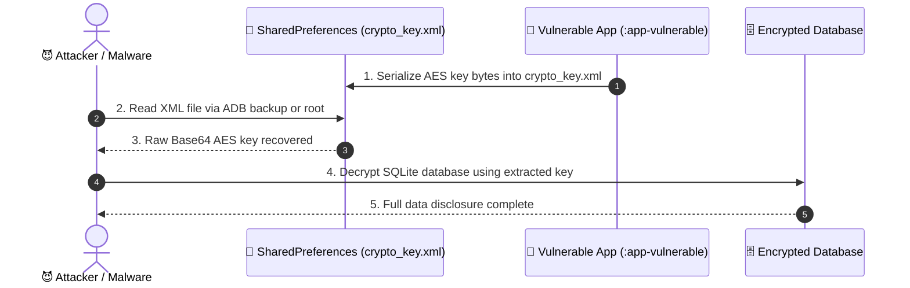

# MASWE-0003: Cryptographic Keys Stored Outside of Platform Keystore

## Overview
**Category:** MASVS-STORAGE  
**Vulnerability:** Cryptographic Keys Stored Outside of Platform Keystore  
**CWEs:** CWE-312 (Cleartext Storage of Sensitive Information), CWE-321 (Hardcoded Cryptographic Key), CWE-318, CWE-311  
**MASTG Tests:** MASTG-TEST-0017, MASTG-TEST-0014  
**MITRE ATT&CK Mobile:** T1409 (Access Stored Data), T1533 (Data from Local System)  
**CVSS v4.0 Score:** **7.5 HIGH** (`CVSS:4.0/AV:L/AC:L/AT:N/PR:N/UI:N/VC:H/VI:N/VA:N/SC:N/SI:N/SA:N`)  
**NIST Standards:** NIST SP 800-57 Part 1 Rev. 5 (§6.2), NIST SP 800-175B Rev. 1 (§5.3.5)  
**Industry Compliance:** PCI-DSS v4.0 (Req 3.5, 3.6), Google Play MASA (§1.1)  

MASWE-0003 covers vulnerabilities where cryptographic keys are stored in unencrypted preferences, regular files, application bytecode, or imported in plaintext without secure wrapped import. Without hardware-backed isolation, attackers with physical access, root privileges, or reverse-engineering capabilities can extract the keys and completely defeat all client-side encryption.

---

## 🛑 Vulnerability Vectors (The "Attacker" Perspective)

Our `:features:maswe0003` module demonstrates 3 key storage anti-patterns:

1. **Insecure Storage Location (SharedPreferences):** Generating an AES key and writing the raw Base64-encoded key bytes into `shared_prefs/crypto_key.xml`.
2. **Hardcoded Cryptographic Key:** Embedding symmetric encryption keys directly into Kotlin source code as a static `byteArrayOf(...)`. Easily extracted via JADX decompilation.
3. **Insecure Plaintext Key Import:** Importing raw key material from remote services without ASN.1 encrypted wrapping and leaking the key string to system Logcat.

### 📊 Attack Flow Sequence

---

## 🛡️ Mitigations & Secure Implementation (The "Secure" Perspective)

Our `:features:maswe0003` secure mirror applies defense-in-depth:

1. **Hardware-Backed Android KeyStore:** Keys are generated directly inside the Android Keystore Provider (`AndroidKeyStore`). Raw key bytes never enter application process memory.
2. **Runtime Key Generation with StrongBox:** Leverages dedicated hardware security chips (StrongBox KeyMint on Android 9.0+) providing physical tamper resistance.
3. **Secure Wrapped Key Import:** Mandates ASN.1 envelope encryption for server-to-client key provisioning, ensuring key material remains encrypted in transit.

---

## 🔬 Automated Verification Suite (`features/maswe0003/poc/`)

| Script | Type | Purpose |
| :--- | :--- | :--- |
| [`frida_hook.js`](file:///Users/PROJECTS_ALL/Appfiliate/AndroidSecurityMasterclass/features/maswe0003/poc/frida_hook.js) | Dynamic Instrumentation | Hooks `SharedPreferences.putString` and `KeyGenerator` to detect software-backed keys and XML leaks |
| [`semgrep_rule.yml`](file:///Users/PROJECTS_ALL/Appfiliate/AndroidSecurityMasterclass/features/maswe0003/poc/semgrep_rule.yml) | Static Analysis (SAST) | Flags hardcoded byte arrays and SharedPreferences key storage in CI/CD pipelines |
| [`adb_verify.sh`](file:///Users/PROJECTS_ALL/Appfiliate/AndroidSecurityMasterclass/features/maswe0003/poc/adb_verify.sh) | ADB Device Automation | Verifies `crypto_key.xml` in application sandbox and inspects Logcat for key import leaks |
