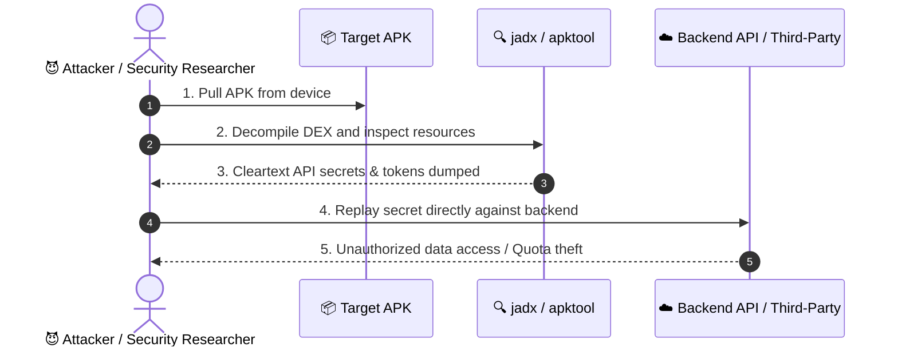
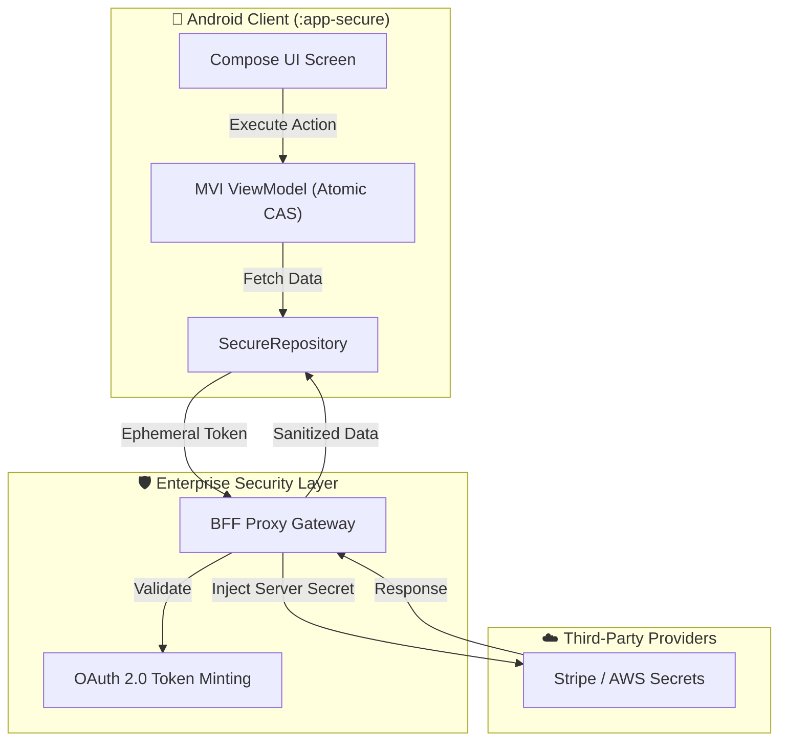

# MASWE-0004: Sensitive Data Hardcoded in the App Package

## Overview
**Category:** MASVS-STORAGE / MASVS-CRYPTO  
**Vulnerability:** Sensitive Data Hardcoded in the Application Package  
**CWEs:** CWE-798 (Use of Hard-coded Credentials), CWE-312, CWE-321, CWE-540  
**MASTG Test:** MASTG-TEST-0004  
**MITRE ATT&CK Mobile:** T1409 (Access Stored Data), T1533 (Data from Local System)  
**CVSS v4.0 Score:** **7.7 HIGH** (`CVSS:4.0/AV:L/AC:L/AT:N/PR:N/UI:N/VC:H/VI:H/VA:N/SC:N/SI:N/SA:N`)  
**NIST Standards:** NIST SP 800-163 Rev. 1 (§4.1), NIST SP 800-218 SSDF (PW.1.2)  
**Industry Compliance:** PCI-DSS v4.0 (Req 3.4 & 8.2), Google Play MASA (§1.1)  

MASWE-0004 covers vulnerabilities where sensitive information (API keys, client secrets, encryption keys, tokens, or staging credentials) is directly embedded inside the compiled application package (APK/AAB). Because client packages execute in an untrusted environment, any secret inside an APK can be extracted within seconds using tools like `apktool`, `jadx`, `strings`, or Frida.

---

## 🛑 Vulnerability Vectors (The "Attacker" Perspective)

Our `:app-vulnerable` module demonstrates 4 distinct hardcoded secret anti-patterns:

1. **App Source Code Secrets:** Embedding static API keys or credentials directly in Kotlin/Java source files (`Constants.kt`). Recoverable via DEX decompilation (`jadx`).
2. **Assets & XML Resource Leaks:** Hardcoding secrets in `res/values/strings.xml`, `assets/config.json`, or unvetted configuration files. Extracted instantly without reverse engineering via `apktool`.
3. **Third-Party Library Hardcoded Secrets:** Packaging 3rd-party SDKs or internal modules containing hardcoded testing secrets, staging keys, or backdoor credentials.
4. **Build & Developer Leftovers:** Leaving staging URLs, internal test tokens, `.map` files, or development identities in release builds.

### 📊 Attack Flow Sequence

---

## 🛡️ Mitigations & Secure Implementation (The "Secure" Perspective)

Our `:app-secure` module applies defense-in-depth to eliminate client-side secrets:

1. **Backend-For-Frontend (BFF) Proxy Architecture:** Static secrets (e.g., Stripe, AWS, AI API keys) are kept exclusively on the server. The mobile app interacts with the backend using authenticated ephemeral JWT sessions.
2. **Restricted Client-Side Keys:** For unavoidable client keys (e.g., Google Maps SDK), enforce Google Cloud Console restrictions locked to **Package Name + SHA-256 Signing Certificate**.
3. **Automated Secret Scanning (SAST):** Integrating tools like Gitleaks and TruffleHog into the CI/CD pipeline to block commits containing secrets.
4. **Clean Release Builds & R8 Shrinking:** Stripping staging artifacts, debug logs, and leftover build configuration files from production APKs with ProGuard/R8.

### 📊 Secure Architecture Diagram

---

## 🧰 Verification & Automation Suite (`poc/`)

The `:features:maswe0004` module includes complete automation scripts:
- **`poc/frida_hook.js`**: Runtime interceptor capturing API keys passed in network requests and string comparisons.
- **`poc/semgrep_rule.yml`**: Static analysis rule for CI/CD gates detecting static credentials.
- **`poc/adb_verify.sh`**: One-line terminal verification pulling the installed APK and scanning DEX strings.
