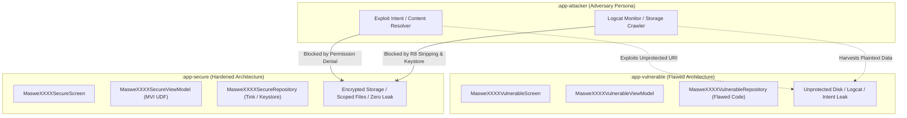

# Multi-Authority Mobile Security Taxonomy & Architecture Specification

This specification establishes the cross-standard architectural threat modeling, verification taxonomy, and defensive engineering blueprint for the `Android Security Masterclass`.

It harmonizes requirements across **OWASP MASVS v2.0**, **MITRE ATT&CK Mobile**, **NIST SP 800-163 Rev. 1**, **NIST SP 800-218 (SSDF)**, **Google Android Security Guidelines**, and **CISA Mobile Zero Trust**.

---

## 1. Multi-Authority Standards Matrix

| Standard / Authority | Focus Area | Application to Android Security Masterclass |
| :--- | :--- | :--- |
| **OWASP MASVS v2.0** | Mobile Application Security Verification | Defines L1 (Standard), L2 (Defense-in-Depth), and MASVS-R (Resilience) profiles across 8 domains: Storage, Crypto, Auth, Network, Platform, Code, Resilience, Privacy. |
| **MITRE ATT&CK for Mobile** | Real-world Adversary Tactics & Techniques | Threat model mapping for active adversarial behaviors: Exfiltration, Credential Access, Defense Evasion, Collection, and Impact. |
| **NIST SP 800-163 Rev. 1** | Vetting the Security of Mobile Applications | Formal software assurance framework evaluating security vulnerabilities, supply chain threats, and sensitive data leakage before deployment. |
| **NIST SP 800-218 (SSDF)** | Secure Software Development Framework | Secure by design principles: automated SAST/DAST verification, cryptographic key hygiene, dependency governance. |
| **Google Android Security** | Platform & Hardware Architecture | Hardware-backed keystore (StrongBox / KeyMint), Scoped Storage (MediaStore & SAF), Cleartext Traffic prohibitions, Jetpack Security & Tink AEAD. |
| **CISA / NSA Mobile Zero Trust** | Zero Trust Architecture for Mobility | Assumes host and network compromise. Requires hardware-rooted trust, authenticated encryption at rest and in transit, and continuous validation. |

---

## 2. Cross-Authority Mapping for Reference Categories

### Domain 1: Data Storage & Privacy (`MASVS-STORAGE` & `MASVS-PRIVACY`)

| Threat Scenario | OWASP MASVS v2.0 | MITRE ATT&CK Mobile | NIST SP 800-163 | Google Android Guideline | CISA Zero Trust Guidance |
| :--- | :--- | :--- | :--- | :--- | :--- |
| **Unencrypted Private DataStore / SharedPrefs** | MASVS-STORAGE-1 MASTG-TEST-0001 | **T1409** (Access Stored App Data) **T1516** (Insecure File Permissions) | Section 4.1: Data in Rest Exposure | Use `EncryptedDataStore` or Tink AEAD. Do not rely on SQLite or binary serialization. | Data at rest must be cryptographically protected under hardware-derived keys. |
| **World-Readable External Storage Exposure** | MASVS-STORAGE-2 MASTG-TEST-0006 | **T1409.001** (External Storage) **T1575** (Shared Resource Tampering) | Section 4.2: Shared Memory Vulnerability | Enforce Scoped Storage (`minSdk >= 26`, `compileSdk = 37`). Never store PII in `getExternalFilesDir()`. | Strict sandbox boundary. No persistent external artifacts without access tokens. |
| **System Console & Telemetry Leak** | MASVS-STORAGE-1 MASTG-TEST-0002 | **T1417** (Input Capture) **T1426** (System Information Discovery) | Section 4.5: Information Disclosure in Logs | Use R8 `-assumenosideeffects` stripping and `@CompileTimeConstant` safe loggers (`SecureLog`). | Zero PII / credential emission to platform logging subsystems. |
| **Path Traversal via FileProvider** | MASVS-PLATFORM-2 MASTG-TEST-0027 | **T1470** (Exploit IPC / Providers) | Section 4.4: Insecure IPC | Prohibit `<root-path path="/" />`. Restrict paths to canonical subdirectory bounds. | Principle of Least Privilege: scoped ContentProvider permissions only. |
| **Indefinite Cache & Scratch Persistence** | MASVS-STORAGE-1 MASTG-TEST-0001 | **T1409** (Access Stored App Data) | Section 4.1: Ephemeral Data Leakage | Immediate explicit removal (`file.delete()`, `deleteOnExit()`). Avoid on-disk scratch if in-memory streaming is possible. | Ephemeral tokens must be erased from volatile and non-volatile memory immediately after processing. |

---

### Domain 2: Cryptographic Architecture (`MASVS-CRYPTO`)

| Threat Scenario | OWASP MASVS v2.0 | MITRE ATT&CK Mobile | NIST SP 800-163 | Google Android Guideline | CISA Zero Trust Guidance |
| :--- | :--- | :--- | :--- | :--- | :--- |
| **Hardcoded Symmetric Keys** | MASVS-CRYPTO-1 MASTG-TEST-0012 | **T1412** (Capture SMS / Credentials) **T1414** (Reverse Engineering) | Section 4.3: Hardcoded Secrets | Generate keys inside `AndroidKeyStore`. Never place byte arrays or strings in source code. | Hardware-rooted secret generation; keys never leave hardware boundary unencrypted. |
| **Filesystem Plaintext Key Storage** | MASVS-CRYPTO-2 MASTG-TEST-0013 | **T1409** (Access Stored App Data) | Section 4.3: Cryptographic Key Exposure | Utilize Envelope Encryption: Data Encryption Key (DEK) encrypted by Key Encryption Key (KEK). | Keys at rest must be protected by asymmetric or hardware-backed master key. |
| **Weak / Insecure Cipher Modes (ECB)** | MASVS-CRYPTO-3 MASTG-TEST-0014 | **T1409** (Cryptanalysis / Data Recovery) | Section 4.3: Cryptographic Algorithm Flaws | Enforce Authenticated Encryption with Associated Data (AEAD: AES-256-GCM, ChaCha20-Poly1305). | NIST SP 800-38D compliance; zero electronic codebook (ECB) mode usage. |
| **Post-Quantum Cryptographic Readiness** | MASVS-CRYPTO-1 (Advanced) | **T1539** (Steal Web Session / Key Material) | NIST FIPS 203 / FIPS 204 (PQC Standards) | Introduce ML-KEM (Kyber) and ML-DSA (Dilithium) key encapsulation via BouncyCastle. | Prepare cryptographic agility for Quantum Decryption Attacks (Harvest Now, Decrypt Later). |

---

### Domain 3: Platform Interaction & IPC (`MASVS-PLATFORM`)

| Threat Scenario | OWASP MASVS v2.0 | MITRE ATT&CK Mobile | NIST SP 800-163 | Google Android Guideline | CISA Zero Trust Guidance |
| :--- | :--- | :--- | :--- | :--- | :--- |
| **Implicit Intent Hijacking** | MASVS-PLATFORM-1 MASTG-TEST-0026 | **T1400** (Broadcast / Intent Interception) | Section 4.4: Insecure IPC | Explicit Component Name setting (`setClassName` / `setPackage`) for all internal IPC. | IPC must include identity authentication and verifiable signature checks. |
| **Warm-Start Intent Dropping** | MASVS-PLATFORM-1 | **T1400** (Adversary Intent Suppression) | Section 4.4: Lifecycle State Handling | Override `onNewIntent(intent)` in singleTask / top activities to process subsequent payloads. | Resilient event ingestion; zero lifecycle state desynchronization. |
| **FileProvider Excessive Granting** | MASVS-PLATFORM-2 MASTG-TEST-0027 | **T1470** (Exploitation of Provider) | Section 4.4: Insecure Content Providers | Set `android:exported="false"`, grant temporary read-only URI permissions per transaction. | Fine-grained, least-privilege capability tokens. |

---

### Domain 4: Network Communication (`MASVS-NETWORK`)

| Threat Scenario | OWASP MASVS v2.0 | MITRE ATT&CK Mobile | NIST SP 800-163 | Google Android Guideline | CISA Zero Trust Guidance |
| :--- | :--- | :--- | :--- | :--- | :--- |
| **Cleartext HTTP Transmission** | MASVS-NETWORK-1 MASTG-TEST-0018 | **T1437** (Application Protocol) **T1439** (Adversary-in-the-Middle) | Section 4.6: Insecure Communication | Enforce `network_security_config.xml` with `cleartextTrafficPermitted="false"`. | Mutual TLS (mTLS) or TLS 1.3 only; zero unencrypted data in transit. |
| **Certificate / Trust Manager Bypass** | MASVS-NETWORK-2 MASTG-TEST-0019 | **T1439** (Adversary-in-the-Middle) | Section 4.6: Trust Evaluation | Restrict trust anchors to `system` certificates; prevent user-installed CA interception. | Strict pin-validation and continuous certificate attestation. |

---

## 3. Reference Implementation Architecture: The Triad Pattern

Each MASWE feature module implements the standard 3-tiered demonstration:

### Module Blueprint Checklist
1. **Repository Layer**:
   - Vulnerable repository illustrates the exact flaw (e.g. ECB mode, root-path FileProvider).
   - Secure repository provides defense-in-depth mitigation (Tink, Keystore, Scoped paths, explicit deletion).
   - Coroutine cancellation safety: must never swallow `CancellationException`.
2. **Presentation Layer (MVI)**:
   - ViewModel extends `MviViewModel<State, Intent, Effect>`.
   - State mutability uses atomic CAS: `updateState { it.copy(...) }`.
   - One-off events flow through `Channel<Effect>(Channel.BUFFERED)`.
   - Screens enforce 52dp touch targets (`heightIn(min = 52.dp)`).
   - Zero hardcoded strings: all UI labels, formatting, and errors reside in `strings.xml`.
3. **Build & ProGuard Configuration**:
   - Features apply `mobsec.android.feature`.
   - Release builds strip logs via R8 `-assumenosideeffects`.
   - AndroidManifest specifies `android:allowBackup="false"` and `android:networkSecurityConfig`.
